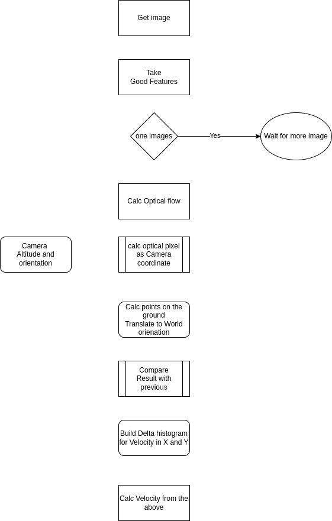

# OF_VIO

Estimate velocity using optical flow




```
Ah, yes — this is about camera intrinsics 🐺. Let’s clarify the relation between image size (width, height) and focal lengths (fx, fy).
```

```
using optical flow for velocity estimate did the edge pixel represent more distance because the bigger angel
```

[ROS Bag](https://drive.google.com/file/d/1xlHTpSBASkNXOoGx_9QsGUhroc6NQD6O/view?usp=drive_link)
